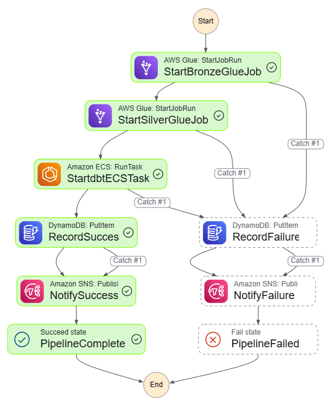
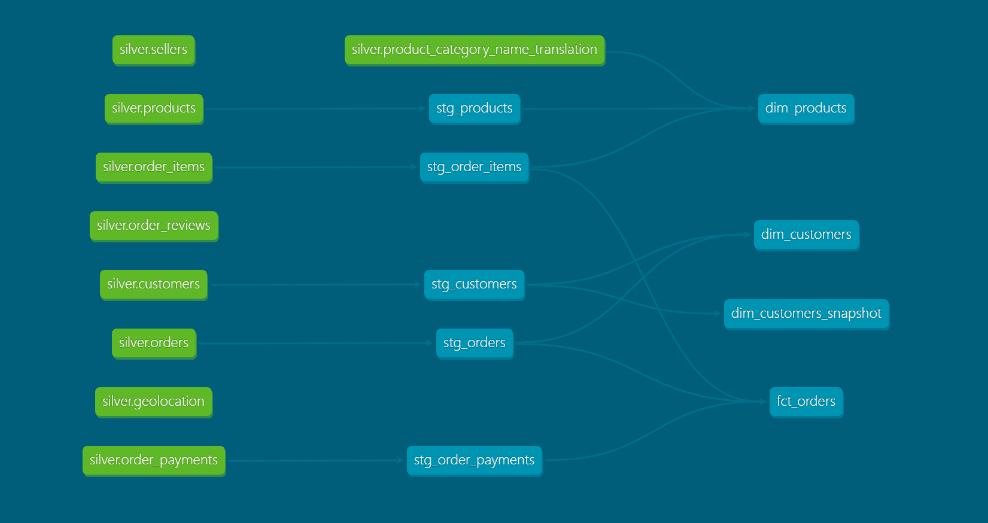
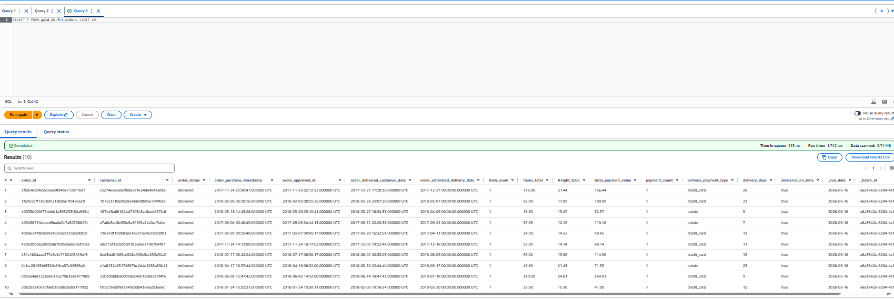

# Retail Lakehouse Platform

Production-style AWS lakehouse platform built on the Medallion Architecture using Apache Iceberg, Glue, dbt, Athena, and Step Functions.

Raw e-commerce CSVs go in, clean analytics-ready Iceberg tables come out.

Processes 1.5M+ records across Bronze, Silver, and Gold layers in ~7 minutes using fully automated AWS orchestration.

Built to demonstrate production-grade data engineering patterns — not just ETL scripts that land CSVs in S3.

---

## Pipeline



```
StartBronzeGlueJob   3m 00s   raw CSV → Iceberg (Bronze)
       ↓
StartSilverGlueJob   2m 02s   clean + validate → Iceberg (Silver)
       ↓
StartdbtECSTask      1m 45s   dbt models → Gold Iceberg tables queried through Athena
       ↓
RecordSuccess                 write run metadata → DynamoDB
       ↓
NotifySuccess                 SNS email
       ↓
PipelineComplete ✅

Any failure → RecordFailure → NotifyFailure → PipelineFailed ❌
```

---

## Production Features

- Apache Iceberg ACID transactions and snapshot isolation across all layers
- Incremental fact table processing with dbt merge strategy
- SCD Type 2 customer history tracking
- End-to-end orchestration with failure handling and SNS alerting
- Least-privilege IAM boundaries between layers
- Infrastructure fully managed through Terraform
- CI/CD validation through GitHub Actions
- Quarantine isolation for invalid records
- Idempotent Glue jobs safe for reruns

---

## What It Does

Takes the [Olist Brazilian E-Commerce dataset](https://www.kaggle.com/datasets/olistbr/brazilian-ecommerce) (1.5M+ rows across 9 tables) and runs it through a three-layer Medallion Architecture:

- **Bronze** — land raw files as Iceberg tables, no transformation
- **Silver** — clean, deduplicate, enforce schema, quarantine bad records
- **Gold** — build analytics models with dbt (dimensions, facts, SCD Type 2)

Everything is orchestrated by Step Functions, infrastructure is Terraform, CI/CD is GitHub Actions.

---

## Stack

| What | How |
|------|-----|
| Table format | Apache Iceberg (all 3 layers) |
| Storage | S3 (Parquet) |
| Ingestion + transform | AWS Glue 4.0 — PySpark |
| Schema enforcement | Glue Silver job — type casting, null checks, value validation, quarantine tables |
| Data catalog | AWS Glue Data Catalog |
| Analytics layer | dbt Core + dbt-athena-community |
| Query engine | AWS Athena |
| dbt runtime | Docker → ECR → ECS Fargate |
| Orchestration | AWS Step Functions (Standard, .sync) |
| Run history | DynamoDB |
| Alerting | SNS → email |
| IaC | Terraform |
| CI/CD | GitHub Actions (OIDC) |

---

## Layers In Detail

### Bronze
Nine Iceberg tables created from raw CSV. No transformation — data is landed with consistent partitioning and Iceberg metadata for downstream reliability.

| Table | Rows |
|-------|------|
| orders | 99,441 |
| customers | 99,441 |
| order_items | 112,650 |
| order_payments | 103,886 |
| order_reviews | 99,224 |
| products | 32,951 |
| sellers | 3,095 |
| geolocation | 1,000,163 |
| product_category_name_translation | 71 |

### Silver
Same nine tables, cleaned. The Glue job enforces:

- **Type casting** — timestamps, decimals, integers cast to correct types
- **Null enforcement** — order_id, customer_id, product_id cannot be null
- **Value validation** — order_status, payment_type, review_score checked against allowed values
- **Deduplication** — 814 duplicate reviews removed, 279,009 duplicate geolocation records removed
- **Quarantine tables** — records failing validation go to `quarantine_orders`, `quarantine_order_items` etc. rather than being silently dropped

### Gold (dbt)
Eight models and one snapshot, all Iceberg.

| Model | Materialization | Notes |
|-------|----------------|-------|
| stg_customers | View | |
| stg_orders | View | |
| stg_order_items | View | |
| stg_order_payments | View | |
| stg_products | View | |
| dim_customers | Table | |
| dim_products | Table | |
| fct_orders | Incremental | merge on order_id |
| dim_customers_snapshot | Snapshot | SCD Type 2 |

38 data tests (not_null, unique, accepted_values, expression_is_true) — all passing in production ECS runs.

---

## dbt Lineage



Silver tables (green) flow through staging models (teal) into Gold dimensions, facts and snapshots.

---

## Gold Layer — Athena Query Result



`SELECT * FROM gold_db.fct_orders LIMIT 10` — showing enriched order records with delivery metrics, payment breakdown and batch tracking.

---

## IAM Design

Four separate roles, each with only what it needs:

```
GlueExecutionRole     → Bronze + Silver S3, Glue catalog
dbtExecutionRole      → Silver read, Gold read/write, Athena, ECR
                        Explicit DENY on Bronze — Gold-layer workloads
                        cannot access raw Bronze data
StepFunctionsRole     → Glue StartJobRun, ECS RunTask, SNS, DynamoDB
AthenaQueryRole       → Gold read only, MFA required
```

---

## Operational Considerations

- Iceberg snapshots enable rollback and historical debugging without reprocessing
- Glue jobs are idempotent and safe to rerun — Iceberg handles duplicate writes correctly
- Step Functions handles orchestration retries and routes unrecoverable failures to SNS alerting
- Quarantine tables prevent bad records from blocking the pipeline — invalid data is isolated, not discarded

---

## Project Structure

```
├── .github/workflows/
│   ├── dbt_ci.yml          # dbt parse on every PR
│   └── deploy.yml          # upload Glue scripts to S3 on merge
│
├── glue_jobs/
│   ├── bronze_ingestion.py
│   └── silver_transform.py
│
├── lakehouse_project/      # dbt project
│   ├── models/
│   │   ├── staging/
│   │   └── marts/
│   │       ├── dimensions/
│   │       └── facts/
│   └── snapshots/
│
├── terraform/              # all infrastructure as code
│   ├── s3.tf
│   ├── iam.tf
│   ├── glue.tf
│   ├── ecs.tf
│   ├── dynamodb.tf
│   ├── sns.tf
│   └── stepfunctions.tf
│
├── docs/
│   └── stepfunctions_graph.png
│   └── athena_query.png
│   └── dbt_dag.png
│
├── Dockerfile
└── entrypoint.sh
```

---

## Running It

**Trigger the pipeline:**

```json
{
  "run_date": "2024-01-01",
  "source": "olist"
}
```

From AWS console → Step Functions → `Retail_Lakehouse_Pipeline` → Start execution, or:

```bash
aws stepfunctions start-execution \
  --state-machine-arn arn:aws:states:us-east-1:959666773387:stateMachine:Retail_Lakehouse_Pipeline \
  --input '{"run_date": "2024-01-01", "source": "olist"}'
```

**Check run history:**
```bash
aws dynamodb scan --table-name lakehouse-pipeline-state
```

---

## Infrastructure

```bash
cd terraform
terraform init
terraform plan
terraform apply
```

If resources already exist in AWS:
```bash
terraform import aws_s3_bucket.bronze retail-lakehouse-bronze
```

---

## CI/CD

Two workflows:

**dbt CI** — runs on every PR touching `lakehouse_project/`. Runs `dbt parse` to validate all model references and SQL before anything merges. No AWS credentials needed — parse does not connect to Athena.

**Deploy Glue** — runs on merge to main when `glue_jobs/` changes. Assumes `GitHubActionsDeployRole` via OIDC and uploads scripts to S3. Glue picks them up on the next run.

---

## Author

Abdul Rafay — Data Engineer

[LinkedIn](https://linkedin.com/in/abdul-rafay-3a0757247) · [GitHub](https://github.com/Rafay879)